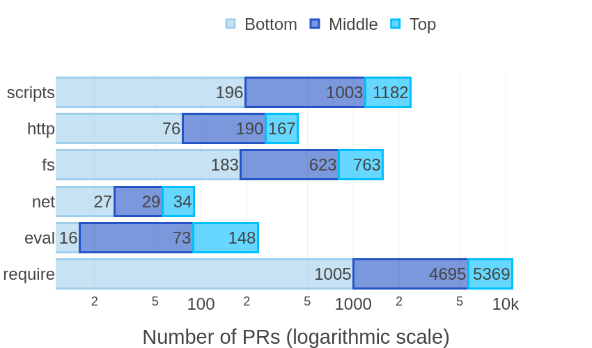

## Marketplace

https://github.com/marketplace/actions/depsafe


# DepSafe (test)

Adopting third-party dependencies has the potential risk for injecting malicious code into your application. To protect your project, we created a very simple bot called **DepSafe**. DepSafe automatically detects any unsafe updates. One potential unsafe function is require(). The require() function is used to import external modules, which can be a subtle way to introduce risky code. 

Basically the action will identify label and raise a comment to bring awareness of the dependency and the files that contain the unsafe update. The require function is one of six unsafe updates identified from our paper, [Lessons from the Long Tail: Analysing Unsafe Dependency Updates across Software Ecosystems paper](https://arxiv.org/abs/2309.04197). 

## Paper Abstract 

A risk in adopting third-party dependencies into an application is their potential to serve as a doorway for malicious code to be injected (most often unknowingly). While many initiatives from both industry and research communities focus on the most critical dependencies (i.e., those most depended upon within the ecosystem), little is known about whether the rest of the ecosystem suffers the same fate. Our vision is to promote and establish safer practises throughout the ecosystem. To motivate our vision, in this paper, we present preliminary data based on three representative samples from a population of 88,416 pull requests (PRs) and identify unsafe dependency updates (i.e., any pull request that risks being unsafe during runtime), which clearly shows that unsafe dependency updates are not limited to highly impactful libraries. To draw attention to the long tail, we propose a research agenda comprising six key research questions that further explore how to safeguard against these unsafe activities. This includes developing best practises to address unsafe dependency updates not only in top-tier libraries but throughout the entire ecosystem.

## Results motivated the development of DepSafe



When detecting unsafe dependency updates, the paper find that these updates are more likely to include the commands `require` in .js files and `new scripts` in package.json files. In contrast, the `net` and  `eval` functions are less prevalent compared to the others. Inspired by the findings, we develop DepSafe to automatically detect the top 2 most prevalent unsafe dependency updates in a pull request.

---

## Quick Start Guide

In order to use DepSafe:
1. Create a folder `.github/workflows`
2. Create a file with .yaml extension
3. Put this code in the file:

```
name: DepSafe

on: 
  pull_request_target:
    types: [opened, reopened, synchronize]

jobs:

  detect-unsafe:
    runs-on: ubuntu-latest
    name: Check pull request with changes
    steps:
      - name: Check PR
        uses: supatsara-wat/DepSafe@v1.0.2 (or other latest versions)
        with:
          owner: ${{ github.repository_owner }}
          repo: ${{ github.event.repository.name }}
          pr_number: ${{ github.event.number }}
          token: ${{ secrets.GITHUB_TOKEN }}
```

4. Don't forget to allow write permission for the GitHub workflow!!
`Settings tab > Actions > General and scroll down to the “Workflow permissions” section.`

---

## Next Actions

### Implementing safer alternatives in place of identified unsafe updates 

Safer alternatives to these unsafe practises exist; but each has its own drawbacks that might not attract use. For example, an alternative to using the `require()` function is to instead use the `import()` function. However, the key limitation is that the import function must be defined at the top of a class, while the require function can be executed at any point in the code.

---

## Paper Citation
If you use DepSafe in a scientific publication, we would appreciate citation to the following paper:
```
@INPROCEEDINGS{supatsara:fse2023,
  author={Supatsara Wattanakriengkrai and Raula Gaikovina Kula and Christoph Treude and Kenichi Matsumoto},
  booktitle={2023 ACM Joint European Software Engineering Conference and Symposium on the Foundations of Software Engineering}, 
  title={Lessons from the Long Tail: Analysing Unsafe Dependency Updates across Software Ecosystems}, 
  year={2023}}
```
